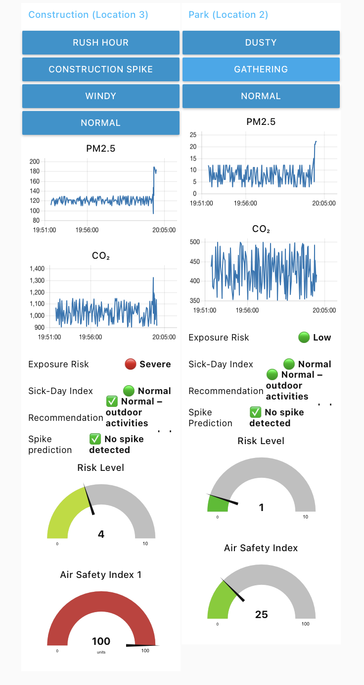

# AirSafePlus — Multi-Location IoT Air Quality Monitoring (Node-RED)

**AirSafePlus** is a production-style IoT monitoring system designed to simulate, analyze, and visualize air quality across multiple urban locations such as parks, construction zones, and traffic areas.

The system is built using **Node-RED** and follows a realistic end-to-end IoT pipeline:

**Sensors → MQTT → Analytics → Dashboard → Alerts & Recommendations**

This project demonstrates how smart-city air quality systems can deliver actionable insights instead of raw sensor data.

---

## 🎯 Project Motivation

Air quality monitoring is a critical smart-city challenge:
- Citizens need clear health-oriented insights, not just PM or CO₂ numbers
- City operators require real-time visibility and early warnings
- IoT systems must be transparent, explainable, and extensible

This project shows how to design an end-to-end IoT analytics solution that can later be connected to real sensors and cloud platforms.

---

## 🚀 Key Features

- Multi-location air quality monitoring
- Scenario-based sensor simulation:
  - Normal conditions
  - Dusty / windy conditions
  - Public gatherings
  - Construction pollution spikes
- Risk level calculation and health-oriented indices
- Real-time interactive dashboard (charts, gauges, indicators)
- Alert logic and user-friendly recommendations
- MQTT-based architecture ready for cloud integration

---

## 🧠 System Architecture (High-Level)

**Data Flow**
1. Location & scenario selection
2. Sensor data generation (PM2.5, CO₂, etc.)
3. MQTT message publishing
4. Analytics & risk calculation layer
5. Live dashboard visualization
6. Alerts and health recommendations

The system is designed to be easily extended with real IoT devices.

---

## 🛠 Tech Stack & Integrations

- **Node-RED** — orchestration and business logic
- **MQTT / HiveMQ** — message broker for sensor data
- **Node-RED Dashboard** — real-time visualization
- **JavaScript Function nodes** — analytics, risk scoring, predictions
- **ThingSpeak-ready architecture** — optional cloud analytics integration

---

## 🖥️ Node-RED Flows & Dashboard

Below are selected screenshots illustrating the Node-RED architecture and the interactive dashboard used for real-time air quality analysis.

---

### 🔧 Node-RED Flow Architecture

Complete multi-location processing pipeline including:
- Scenario generators
- Sensor simulation
- Spike prediction
- Risk engines
- MQTT publishing
- Dashboard outputs


---

### ✅ Dashboard — Normal Environmental Conditions

Example of a low-risk scenario with stable PM2.5 and CO₂ levels.  
The system reports normal exposure risk and recommends outdoor activities.


---

### ⚠️ Dashboard — High Risk & Alerts

Example of a high-risk situation caused by pollution spikes.  
The system detects increased exposure risk, updates health indices, and generates actionable alerts.



---

### 📊 Dashboard — Metrics, Indices & Predictions

Detailed view of:
- PM2.5 & CO₂ time series
- Exposure risk level
- Sick-Day Index
- Air Safety Index
- Spike prediction indicators


---

## ▶️ How to Run (Node-RED)
## 🧾 Node-RED Flow Export

The full Node-RED flow used in this project is included in the repository.

- **Flow file:** [`flows/AirSafe+-Final-Flow.json`](flows/AirSafe+-Final-Flow.json)

⬇️ **Direct download:**  
[Download AirSafe+ Node-RED Flow (JSON)](flows/AirSafe+-Final-Flow.json?raw=1)

### How to import the flow
1. Open **Node-RED**
2. Menu → **Import**
3. Upload the downloaded JSON file
4. Click **Deploy**

1. Start Node-RED:
```bash
node-red

2.	Open the editor:
http://localhost:1880

3.	Import the flow:

	•	Menu → Import
	•	Upload:
flows/AirSafe+-Final-Flow.json

4.	Deploy the flow
5.	Open the dashboard:
http://localhost:1880/ui

📂 Repository Structure
AirSafePlus-IoT-NodeRED/
├── flows/        # Exported Node-RED flows (.json)
├── assets/       # Dashboard & flow screenshots
├── docs/         # Project documentation / report
├── README.md
├── LICENSE
└── .gitignore

📈 Practical Value
	•	Demonstrates a realistic smart-city IoT use case
	•	Shows how to structure IoT analytics pipelines
	•	Easily adaptable to real sensors and cloud platforms
	•	Focus on clarity, explainability, and usability

⸻

🔮 Future Improvements
	•	Integration with physical sensors (ESP32, Arduino, Raspberry Pi)
	•	Cloud deployment (AWS IoT, Azure IoT Hub)
	•	Advanced anomaly detection
	•	Mobile-friendly dashboards
	•	Integration with public health systems

⸻

⚖️ License

This project is released under the MIT License.
  
